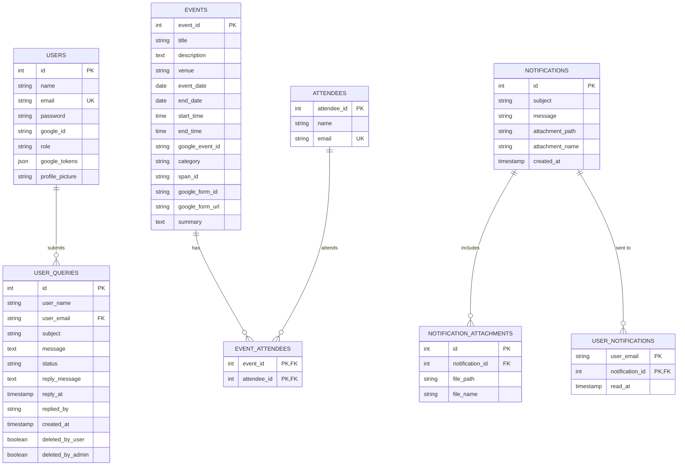
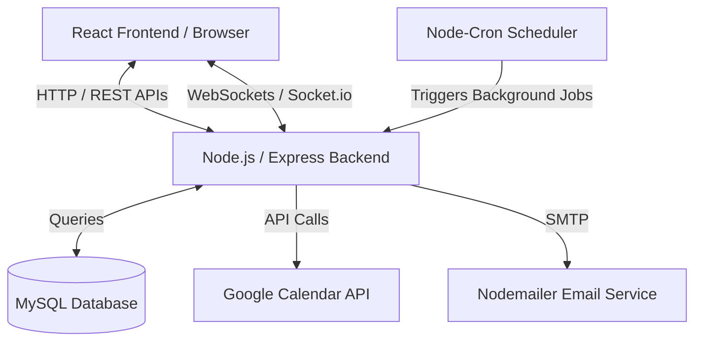
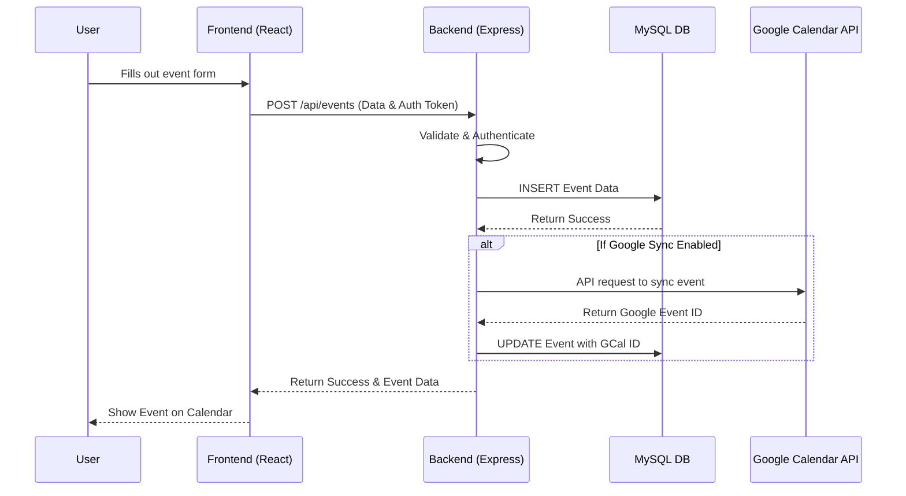
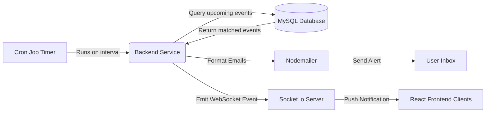

# Schedule Management System

## Project Description
The **Schedule Management System** is a full-stack web application designed to help users efficiently manage their events, schedules, and daily tasks. It features a robust real-time notification system, Google Calendar integration, automated email reminders, and a user-friendly interface. It allows users to seamlessly stay on top of their schedules while providing administrators with tools for managing queries and feedback.

## Technology Stack

### Frontend
- **React.js (Vite)** - Fast, modern UI development.
- **Tailwind CSS & Mantine UI** - Comprehensive and responsive styling and component libraries.
- **React Big Calendar** - Interactive calendar interface for event management.
- **Socket.io-client** - Real-time client-side WebSocket connections.
- **Axios** - HTTP client for API requests.

### Backend
- **Node.js & Express.js** - Scalable server architecture.
- **MySQL2** - Relational database connection pool for secure data storage.
- **Socket.io** - Real-time bidirectional event-based communication (for notifications).
- **Node-Cron** - Task scheduler for executing automated background jobs.
- **Nodemailer** - Service for sending automated email reminders and alerts.
- **Google APIs** - Integration with Google Calendar services.
- **Multer** - Middleware for handling file and profile picture uploads.
- **JWT & Bcrypt** - Secure authentication, authorization, and password hashing.

## Categories / Features Provided

1. **User Authentication & Profile Management**
   - Secure login and registration using JWT.
   - Profile picture uploads and management.

2. **Event & Calendar Management**
   - Create, read, update, and delete (CRUD) events seamlessly.
   - View events on an interactive monthly/weekly calendar.

3. **Google Calendar Integration**
   - Sync events directly with your Google Calendar account.

4. **Real-Time Notifications**
   - Receive instant push notifications via WebSockets when an event is updated or approaching.

5. **Automated Reminders (Cron Jobs)**
   - Background jobs constantly monitor upcoming events and trigger email alerts.

6. **User Queries & Support System**
   - Users can submit queries or support tickets.
   - Admins can review, track, and reply to these queries directly.

7. **Feedback System**
   - Dedicated module to collect and analyze user feedback.

## Architecture & Flow Diagrams

### Database Entity-Relationship (ER) Diagram


### High-Level Architecture


### Event Management Flow


### Notification & Automated Reminders Flow


## How to Implement & Steps to Follow

Follow these steps to set up and run the application on your local machine:

### Prerequisites
- [Node.js](https://nodejs.org/) installed.
- [MySQL](https://www.mysql.com/) database server installed and running.

### Step 1: Clone and Navigate
If you haven't already, open your terminal and navigate to the project directory:
```bash
cd schedule-management-system
```

### Step 2: Install Dependencies
This project uses `concurrently` to manage both frontend and backend. You can install all necessary packages across the root, frontend, and backend by running:
```bash
npm run install-all
```

### Step 3: Database & Environment Setup
1. Open your MySQL client and create a new database for the system.
2. Navigate to the `backend` directory and configure your environment variables in a `.env` file.

*Example `backend/.env` configuration:*
```env
PORT=3000
DB_HOST=localhost
DB_USER=root
DB_PASSWORD=your_mysql_password
DB_NAME=your_database_name
JWT_SECRET=your_jwt_secret

# Email Service Configuration (Nodemailer)
EMAIL_USER=your_email@example.com
EMAIL_PASS=your_email_app_password

# Google Calendar API Credentials
# Include necessary keys here if using Google API
```
*Note: The system will automatically create the `user_queries` table and handle schema initializations on the first successful database connection.*

3. Navigate to the `frontend` directory and create its `.env` file (if required, for setting base API URLs).

### Step 4: Run the Application
You can run both the frontend and backend servers simultaneously from the root directory using the custom scripts provided:

**For Development Mode (with hot-reloading for both front and back):**
```bash
npm run dev
```

**For Standard Start:**
```bash
npm run start
```

- **Frontend** will typically be accessible at: `http://localhost:5173`
- **Backend API** will run at: `http://localhost:3000`

### Step 5: Build for Production (Optional)
To build the frontend for production deployment:
```bash
npm run build
```
